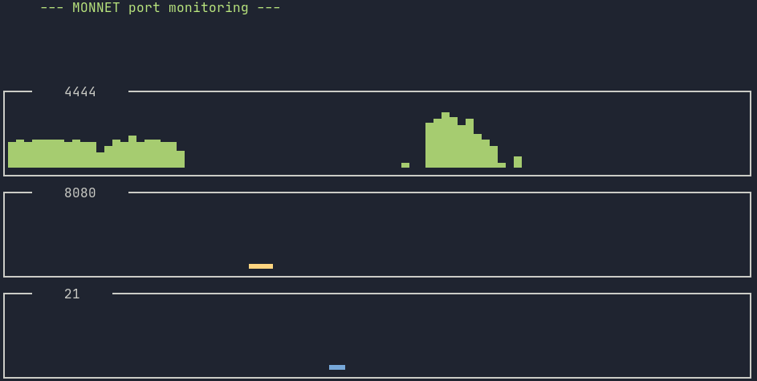

# REAMDE

A command-line tool for quickly graphing network traffic per port.



## Install

built with https://github.com/FedericoCeratto/dashing  
`pip3 install dashing pyshark netifaces`

## Usage

```
usage: monnet.py [-h] [-i INTERFACE] ports

positional arguments:
  ports                 ports to listen to, comma separated

optional arguments:
  -h, --help            show this help message and exit
  -i INTERFACE, --interface INTERFACE
                        interface to listen to

```

## Notes

Currently monitors incoming traffic, can be modified to monitor outgoing too. 
Works by running quick packet captures and inspecting traffic, not garunteed to see *every* packet since time between captures will go unmonitored.